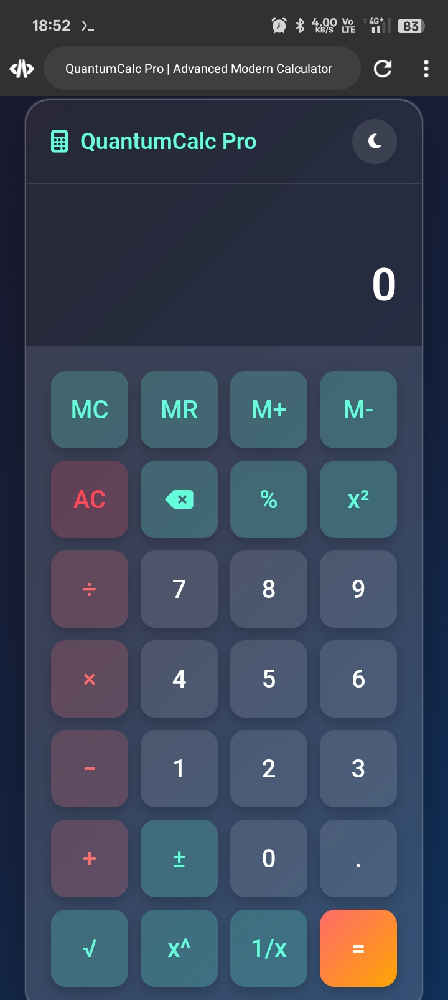

# modern-calculator
A sleek, modern calculator with advanced features, memory functions, and theme switching.

# QuantumCalc Pro - Modern Advanced Calculator

QuantumCalc Pro is a sleek, modern calculator with advanced features and a responsive design. It includes both basic and scientific functions, memory operations, and a customizable dark/light theme.

## Features

- **Basic Operations**: Addition, subtraction, multiplication, division
- **Scientific Functions**: 
  - Square (x²)
  - Square root (√)
  - Power (x^y)
  - Inverse (1/x)
  - Percentage (%)
  - Sign change (±)
- **Memory Operations**: MC, MR, M+, M-
- **Themes**: Toggle between dark and light mode
- **Keyboard Support**: Full keyboard accessibility
- **Responsive Design**: Works on all device sizes
- **History Display**: Shows previous calculations
- **Error Handling**: Graceful handling of invalid operations

## Live Demo
[View Live Demo](https://sarajittbiswas.github.io/modern-calculator/)

## Installation

No installation required! Simply open `index.html` in any modern browser.

## Usage

1. Use mouse or keyboard to input numbers and operations
2. Click "=" or press Enter to calculate
3. Use memory buttons to store/recall values
4. Toggle theme with the moon/sun icon

## Keyboard Shortcuts

- **Numbers**: 0-9
- **Operators**: +, -, *, /
- **Enter**: Calculate
- **Escape**: Clear all
- **Backspace**: Delete last digit
- **%**: Percentage
- **.** : Decimal point

## Contributing

Contributions are welcome! Please fork the repository and submit a pull request.

## License

This project is licensed under the MIT License - see the [LICENSE](LICENSE) file for details.

## Author

Sarajit Biswas - github.com/sarajittbiswas